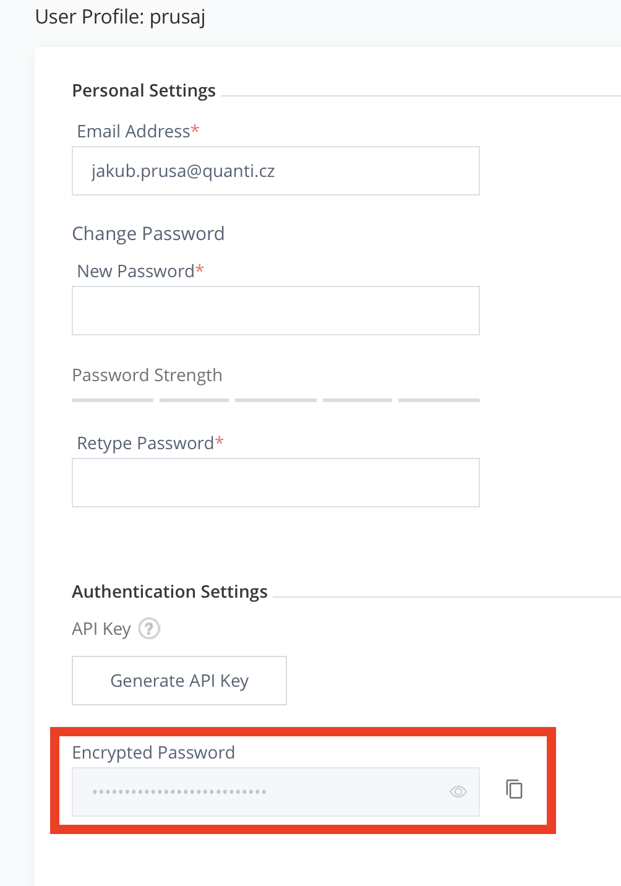
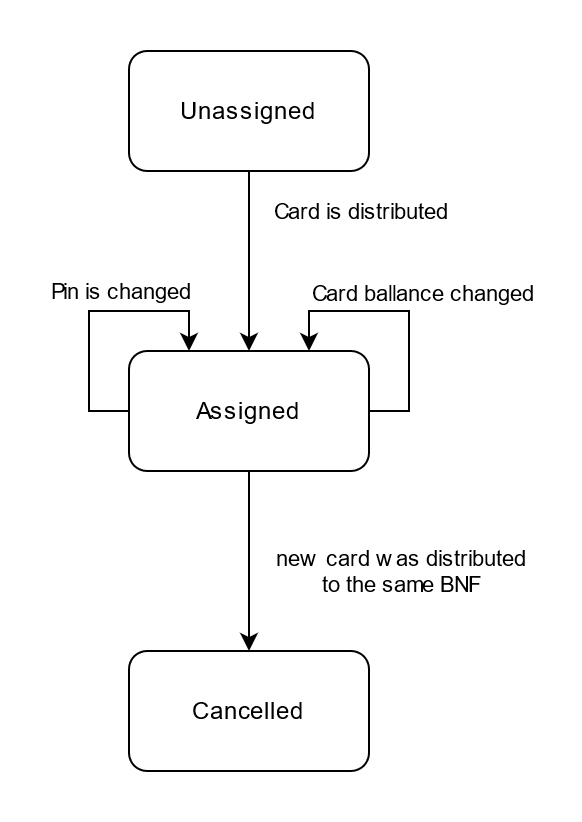

# User app

This application is made for users working for PIN in the field. 

## Project setup 

To be able to develop this application you need several to fill several properties in `gradle.properties` 

One of most important is: 

```
# Artifactory
artifactoryUsername=${ARTIFACTORY_USER}
artifactoryPassword=${ARTIFACTORY_PASS}
```

Your username is the same username for all our systems. Password is obviously your password, but it's highly recommended to use an encrypted version of the password which can be obtained from an artifactory web interface. So in case your `gradle.properties`  get compromised no-one will know your exact password. 

Artifactory is necessary because project depends on NFC secure library which we are developing as well. 



## Docker mock server

App is ready to work with docker swagger mock server with emulator. If you want to use mock server with an actual smartphone, do this:
1. turn on hotspot on your computer
1. open port 8091 in firewall
1. run cmd ipconfig to find your virtual adapter ip address
1. open gradle.properties and change LOCAL_API_URL from 10.0.2.2 to your ip address
1. paste <domain includeSubdomains="true">1your_ip_address</domain> to res/xml/network_security_config.xml
1. build, run and connect your smartphone to your hotspot

## Smartcard Lifecycle 

Every new smartcard is in `unassigned` state.

After card was distributed to a beneficiary, its state changes to `assigned`. Changing the ballance or pin does not change cards state.

If the beneficiary gets another smartcard distributed, his previous smartcard gets automatically `cancelled`.



## CI/CD Workflow
The current workflow is following: 

With every commit, CI automatically trigger build and test if `debug` and `release` variant can be built. 

Optionally there is an option to create APK under archive jobs. 

Those APKs can be downloaded directly from Gitlab or uploaded to artifactory. 

It's very important to use properly versioning in user app in file `app/build.gradle`

```
	// Major updates are non-compatible, meaning consumers can not upgrade without changing their software where applicable.
	def VERSION_MAJOR = 1
	// Minor updates are backward compatible, meaning consumers can upgrade freely. Main for non-breaking new functionality.
	def VERSION_MINOR = 0
	// Patch updates are interchangeable, meaning consumers can upgrade or downgrade freely. Mainly for bug fixing.
	def VERSION_PATCH = 0
```
 ### TBD

 Added automatic upload to google play! 

## Important links
 - **Artifactory repository**
 	- https://artifactory.quanti.cz/ui/repos/tree/General/user_app-gradle-local
- **Direct file download**
	- https://artifactory.quanti.cz:443/artifactory/user_app-gradle-local/

Name and password are LDAP (so same as JIRA / Gitlab / Nextcloud)
- **AWS**
	- http://apks.humansis.org.s3-website.eu-central-1.amazonaws.com/user-app/
